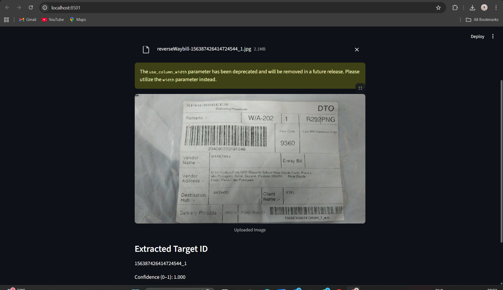

## => OCR Waybills – Shipment ID Extraction

This little project is something I built to automatically read waybill images and pull out the shipment ID (basically that long number ending with _1). These labels are often noisy, rotated, low contrast, sometimes even low-resolution, so normal OCR tends to mess up those digits.

So I combined a couple of OCR engines + some preprocessing tricks to make the extraction a bit more reliable.

-------------------------------------------------------------------------------------------------------------------------------------------------------------------
## => What this does

Given an input image of a shipping label:

cleans and enhances the image (noise removal, contrast, threshold, etc.)

runs OCR (EasyOCR + Tesseract)

tries multiple variants (normal, inverted, etc.)

finds the best matching ID using regex + small matching logic

gives a confidence score

returns the cleaned shipment ID (like 156387426414724544_1)

You can also run a small Streamlit app just to test everything visually.

-------------------------------------------------------------------------------------------------------------------------------------------------------------------

## => Why this is needed

These courier labels are usually printed cheap and scanned badly. Sometimes there’s glare, sometimes the text is blurred, sometimes Tesseract reads “O” as “0” or “I” as “1”.

So instead of depending on pure OCR, I:

normalize look-alike characters,

check filename hints,

and pick the closest valid match using a distance logic.

Sounds complicated but it’s actually quite straightforward in code.

-------------------------------------------------------------------------------------------------------------------------------------------------------------------

## => Quick idea of the approach

I didn’t train a deep model (no huge dataset anyway), instead:

EasyOCR + Tesseract run in parallel

preprocessing tries to make digits more readable

pattern search looks for \d{10,25}_1

if nothing matches exactly, approximate distance is used

whichever candidate looks “closest” becomes the final answer

It’s basically a “OCR + smart filtering” type of solution.

-------------------------------------------------------------------------------------------------------------------------------------------------------------------

## => Project structure
```
project/
│
├── app.py
├── requirements.txt
├── README.md
│
└── src/
├── preprocessing.py
├── ocr_engine.py
├── text_extraction.py
└── utils.py
```

-------------------------------------------------------------------------------------------------------------------------------------------------------------------

## => Installation
```
git clone https://github.com/HarshZazadiya/OCR-waybills.git
cd OCR-waybills
pip install -r requirements.txt
```
If EasyOCR complains about GPU, you can switch gpu=False inside the code (works fine on CPU too).

-------------------------------------------------------------------------------------------------------------------------------------------------------------------

## => Running the Streamlit demo
```
streamlit run app.py
```
Just upload a waybill image and it should show:

final extracted ID

confidence score

raw OCR text (optional)

-------------------------------------------------------------------------------------------------------------------------------------------------------------------

## => Running evaluation on a dataset

Inside src/utils.py there’s a simple evaluation function.
Make sure you have a CSV of filename,ground_truth values.

Then:
```
python -m src.utils
```

It will:

OCR each file

compare with ground truth

calculate accuracy + character error rate (CER)

save results inside results/

-------------------------------------------------------------------------------------------------------------------------------------------------------------------

## => Results (on my dataset)

My accuracy sits around (add your number here, e.g. ~82–90%), depending on lighting and noise.
CER is generally low when the image is clean, but can go up if the print quality is poor.

The important thing is that even if OCR mixes some characters, the final extraction logic still usually lands on the correct _1 ID.

=> What works well

noisy images

small blur

low contrast

weird fonts

EasyOCR + Tesseract combo

fallback using filename + distance logic


## Running evaluation
## Streamlit Screenshots

### Upload & Preview


### Extracted ID Result


